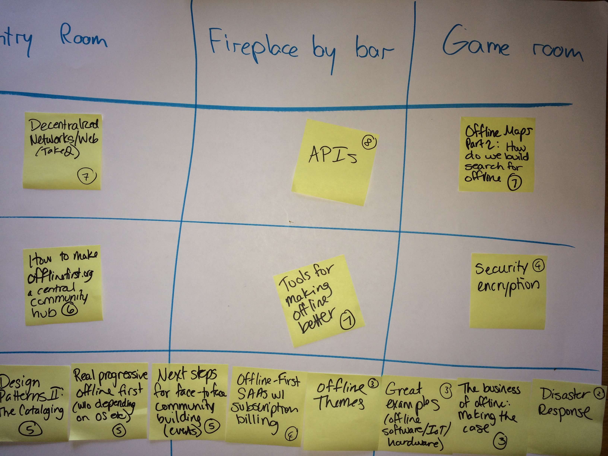
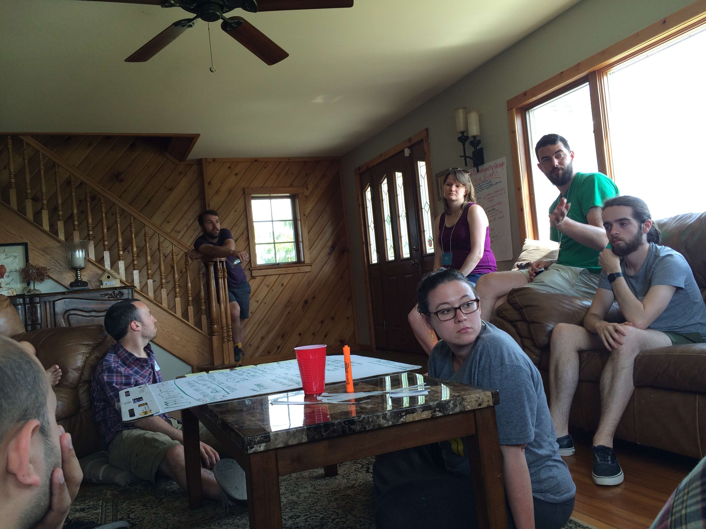
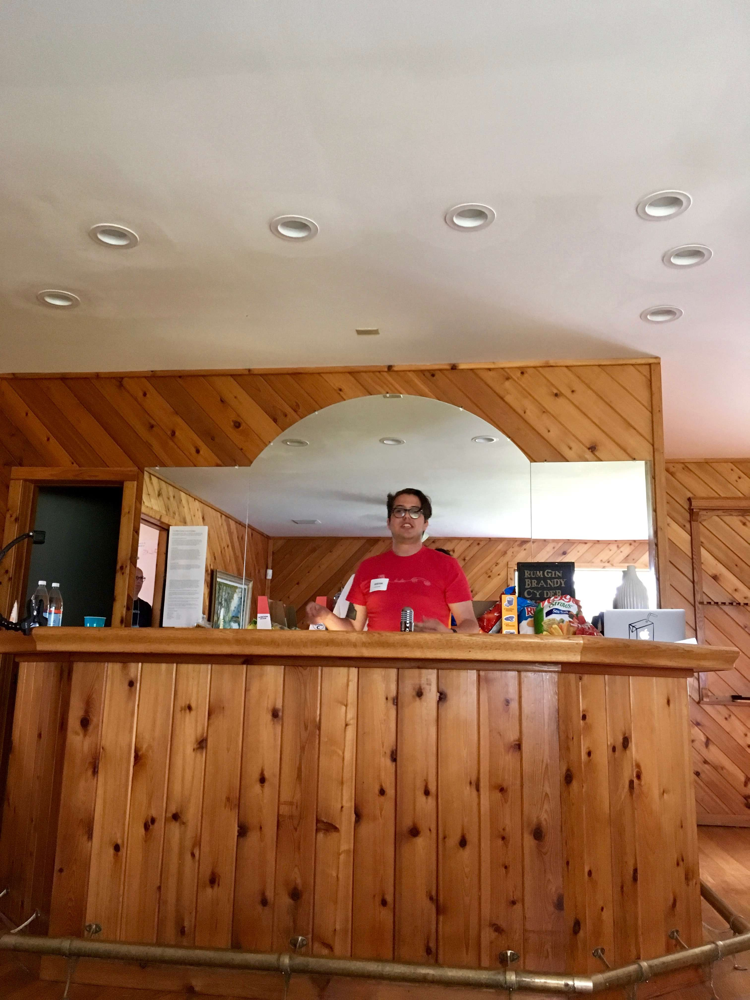

# [fit] Offline (First) Camp
## with Nathan Stilwell

---

# What is Offline First?

---

> Offline First is a movement to build products that better deal with low bandwidth and low power environments.

---

# The Organizers

---

^ Gregor Martynus
^ Steve Travathan
^ Bradley Holt
^ Teri Chadbourne
^ Maureen McElaney

---

# The Location

---

^ Four Seasons "My Estate" in Jewett, NY

---

# The Attendees

---

---

# The Format

---

---

---

---

---

---

---

# Passion talks

---

---

# Themes that arose

---

### themes
+ UX and Engineering patterns
+ Maps
+ Service Worker
+ Community

---

## Sessions
+ Building an Offline First Community
+ API design
+ Tools for building Offline First
+ Decentralized Network design
+ Offline Maps
+ Design Patterns
+ Alerts and Notifications

---

## Sessions (cont)
+ Offline Security
+ Physical Web and beacons

---

# Sponsorship

---

## There were "micro" sponsorships

---

---

# And corporate sponsorships
## Meetup sponsored a Pool Party!
---

---

# What does this mean for Meetup?

---

## "Offline First" is a community and a movement, I hope Meetup can be an ally as well as a tool for them. Meetup as a business and a mission have a lot in common with Offline interests.

---

# Thanks
